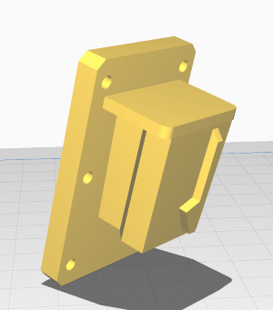
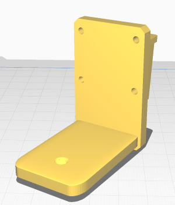

# Rotrics Control Software
Tools, workflows, code, and documentation for controlling the Rotrics DexArm 

There are 3 main software methods of interacting with the Rotrics Dexarm. Follow these links to get instructions for each. 

- Rotrics Studio

- Python API  

- [Ardavan Bigdoli's DexArm repository](https://github.com/CreativeInquiry/Rotrics_arm) 
 

## End effectors
Currently the STUDIO has the pen plotter attachment for the DexArm.   

Other modules such as the laser attachment and 3D printing attachment have auxillary parts in the STUDIO and documentation on the Rotrics site, but can only be used with express permission by STUDIO staff and prior BioRaft laser and 3D training.
 
This repository has a number of STL files in the 'assets/print_files' folder that can be 3D printed to make new end-effectors for the DexArm

| Name | image | 
| ------- | -------- |
| [Universal-end-effector]() |  | 
| [1/4 inch camera mount]() | |