# Rotrics Studio
This is a quick start guide, meant to take you through the most basic functions as quickly as possible. 

For in depth, official documentation visit the [Software Documentation](https://manual.rotrics.com/product-overview/software-rotrics-studio)
## Installation
Follow [this link]('https://rotrics.com/pages/downloads'
) to download the Rotrics Studio desktop app.

OR  
Go to the "releases" section of this repository for mac(.dmg) and windows(.exe)
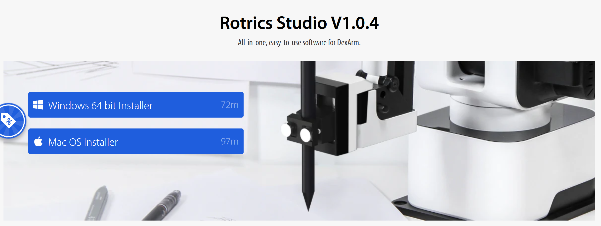

when we open the Rotrics app we are met with this dashboard that will show us the range of the arm (no rail).
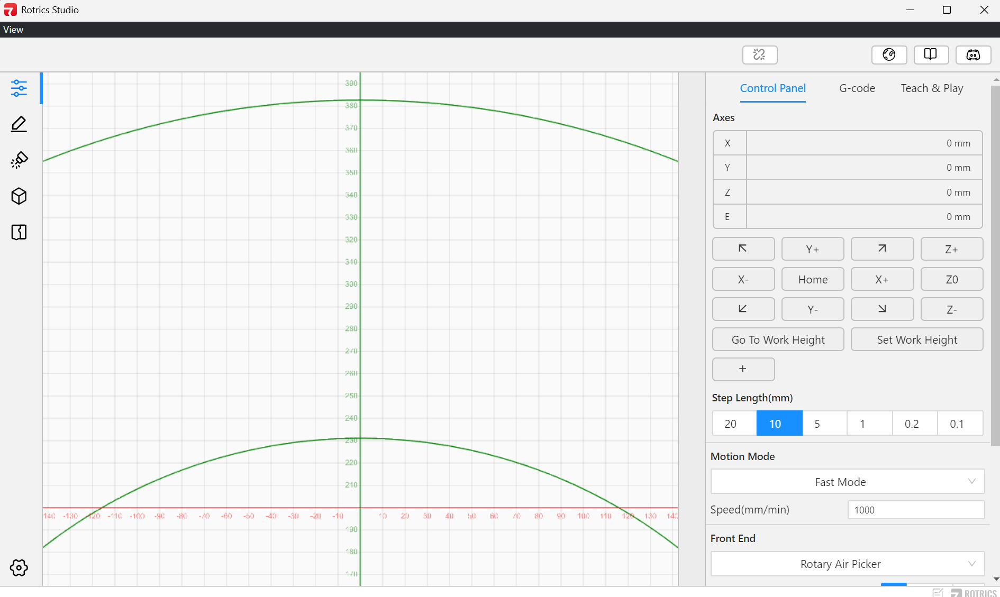
## Connect Dexarm  
>The Dexarm must be connected with a specific USB-A -> USB-C data cable that is to be paired with the Dexarm at all times.

From this opening window we can connect to the plotter with a USB port, and click this broken chain icon to establish a connection.  

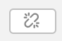 
 
When we select this menu, and we have the dexArm connected to the computer, we can select the corresponding USB port, and select it. Once the window reads that we are connected 
 
## Control Panel
After we connect the Dexarm, the control panel becomes usable. 
- `Axes` list out in realtime the position of the arm in XYZ.
- `HOME` places the X and Z = 0 , and Y = 300mm 
- `XYZ +/-` These buttons nudge the plotter in respective directions by a specific `Step lengths'
- `Go to / Set Work Height` These buttons, set the position that plotting happens on the Z, and automatically can go to that plotting height 

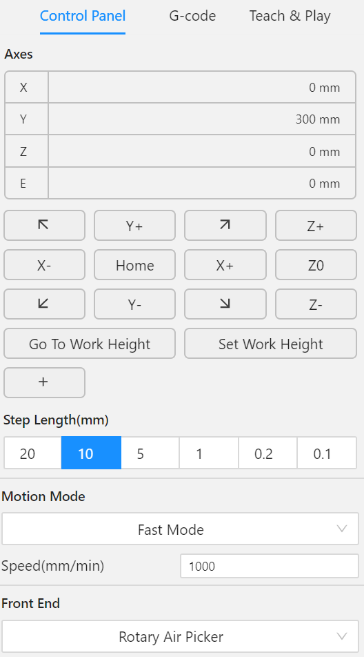
## Write & Draw
On the left hand side of the Rotrics Studio App is the "Write & Draw" menu. 
 
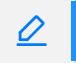

Once we select this menu, we are met with a very similar interface that let us do a few key operations with .gcode and .svg files. 

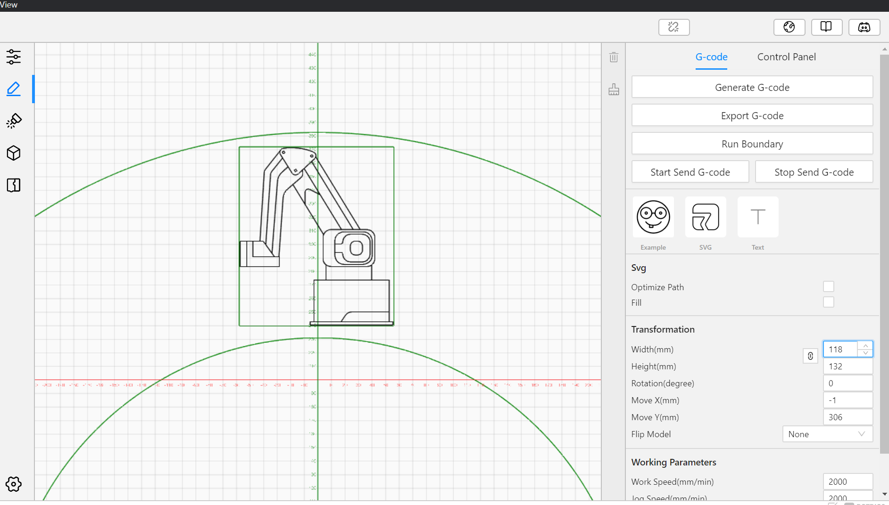 
 
In the example image, I chose a preloaded "example" SVG that will fit within the green arc of the plotter's range.  
The corresponding size and location of the SVG is controlled by a set of transformations that reveal themselves on the right hand side.  

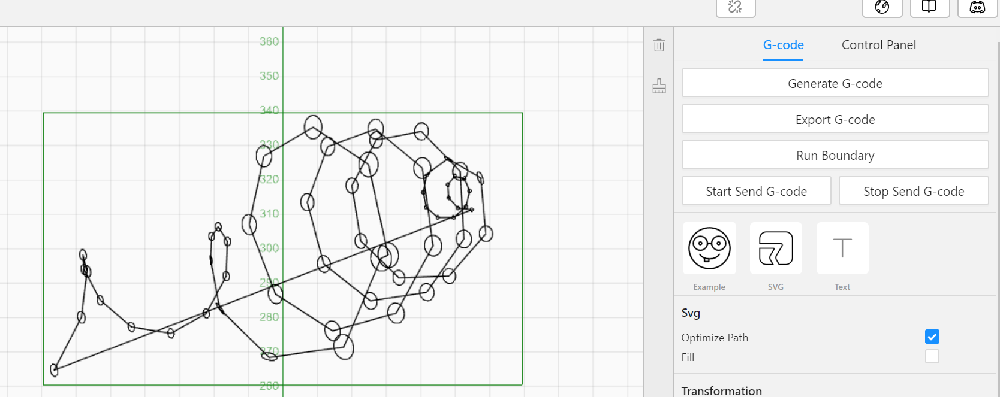 

In order to import premade SVGs, you can click the "SVG" icon, and select the file from your harddrive.  
> Once the svg is properly sized and placed in the range of the dexarm, it is highly encouraged to select the "Optimize Path" checkmark. This implements a "greedy" algorithm that tries to solve the path with the least amount of travelling. 
 
- ### Generate G-Code
  - Creates a .gcode file for the svg you have loaded into the interface
  >NOTE: you can generate the G-Code for this step in another program like Inkscape or Illustrator with these [plugins](https://manual.rotrics.com/get-start/drawing-and-writing/generate-writing-drawing-g-code-with-inkscape)
- ### Export G-Code
  - Sends the file to the plotter, and executes your drawing.  
## Rail 
In order to start using the rail with the plotter, you mus first connect the two. 
Follow this wiring guide for when the DexArm is mounted to the rail (asit should typically be)
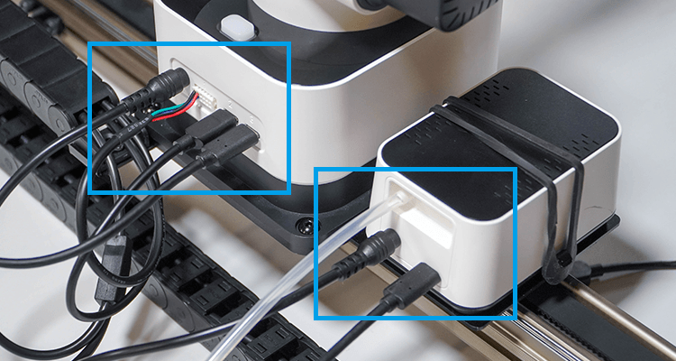  

Once the rail is connected, hit the "Intitialization" button to register the rail's position. Afterwards, the robot will go to position "0mm" and stay there until further instruction.  
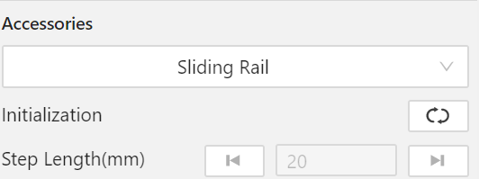
If you would like to move the rail in any particular dimenstion, you can select a "step distance" and a direction, to push the robot. 

In order to interpret X position of a plot with a rail position, you must turn first go to "Settings" -> Config-> and check the "Advanced" button. Hovering over this button gives us this helpful message. 
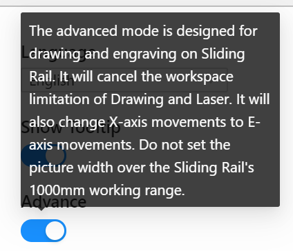 

When you return to the "Write and Draw" workspace, you will no longer see the green outline of the robot path.
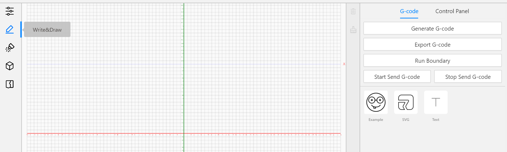 
At this point, the origin of the drawing is (0,0), which is different from the normal drawing mode's need for a drawing to fit within the green arc.  

At this point we can take long (up to 1 meter) SVGs, and plot them with the rail position as X. 

## Scratch Interface 

